# Frost

Frost is a utility for creating immutable object proxies in the Sandbox library. It provides a way to create deeply
frozen objects that prevent direct modifications while still allowing controlled changes via `sandbox` and `cement`.

## Why use Frost?

There are many ways to achieve immutable behavior in JavaScript, but most of them have limitations. Typically,
immutability aims to prevent unintended changes to data, requiring data to be cloned or copied before modification. This
approach can be inefficient and cumbersome, especially for large or nested objects, making it hard to discern whether an
object is immutable in a given context.

Frost, by contrast, creates immutable proxies that can be selectively modified in a controlled manner. Objects frosted
by Frost are clearly marked as immutable, and any attempts to modify them directly will throw an error—unless they are
sandboxed and cemented. This ensures objects won’t be unexpectedly modified while still allowing changes when necessary.

When you call `frost()` on an object, it creates a proxy that intercepts any attempts to modify the object directly,
throwing an error to prevent unintended changes. However, the proxy can be sandboxed using `sandbox` and `cement` to
make temporary changes within a sandbox and then apply those changes to the original object when needed.

```mermaid
graph TD
    A["Original"] -->|"frost(obj)"| B["Frosty"]
	B --> |"Modify"| E["Error thrown"]
    B --> |"sandbox(frostObj, #123;mode: 'copy'&#125;)"| C["Frosty Sandboxed (copy)"]
    B --> |"sandbox(frostObj, #123;mode: 'modify'&#125;)"| D["Frosty Sandboxed (modify)"]
    C --> |"Modify"| F["Frosty Sandboxed Modified (Modify)"]
    D -->|Modify| G["Frosty Sandboxed Modified (Copy)"]
    F --> |"cement(sbObj)"| B
    G --> |"cement(sbObj)"| H["Cemented (New Copy)"]

    style A fill:#f9f,stroke:#333,stroke-width:4px,color:#000
    style B fill:#ccf,stroke:#333,stroke-width:2px,color:#000
    style C fill:#cff,stroke:#333,stroke-width:2px,color:#000
    style D fill:#cff,stroke:#333,stroke-width:2px,color:#000
    style F fill:#fc9,stroke:#333,stroke-width:2px,color:#000
    style E fill:#CC0000,stroke:#333,stroke-width:2px,color:#fff
    style G fill:#fc9,stroke:#333,stroke-width:2px,color:#000
    style H fill:#9f9,stroke:#333,stroke-width:2px,color:#000
```



## How does it work?

Frost provides a unique approach to immutability that goes beyond traditional methods like `Object.freeze` or libraries
like Immer. The key feature of frost is its ability to create immutable objects that can be selectively unfrozen and
modified in a controlled manner. This allows you to pass objects around your application with confidence that they won't
be unexpectedly modified, while still retaining the ability to make changes when necessary.

###

Any attempt to set a value on the original object is blocked, unless it is set using frost's required setter symbol.
This is to prevent the original object from being modified in any way by normal means, while still allowing sandbox to
modify it via cementing.

The pattern is as such:

#### Normal development (blocked)

```typescript
const original = { a: 1 };
const frosty = frost(original);
frosty.a = 2; // Error thrown: Cannot modify property "a" of the original object.
```

#### Sandbox/cement development (allowed)

```typescript
const original = { a: 1 };
const frosty = frost(original);
const sandbox = createSandbox(frosty);

console.log(original.a, frosty.a, sandbox.a); // 1, 1, 1

// Allowed, but only affects the sandboxed object
sandbox.a = 2;
console.log(original.a, frosty.a, sandbox.a); // 1, 1, 2

// Allowed, but only affects the sandboxed object
cement(sandbox);
console.log(original.a, frosty.a, sandbox.a); // 2, 2, 2
```

# Usage

### Basic Usage

```typescript
import { frost } from "./frost";

const originalObject = { a: 1, b: { c: 2 } };
const frostedObject = frost(originalObject);

// Attempting to modify the frosted object directly will throw an error
frostedObject.a = 2; // Throws: Cannot modify property "a" of the original object.
```

### Integration with [Sandbox](../../../README.md)

```typescript
import { frost } from "./frost";
import { sandbox } from "../sandbox";
import { cement } from "../cement";

const originalObject = { a: 1, b: { c: 2 } };
const frostedObject = frost(originalObject);

// Create a sandbox to modify the frosted object
const sandboxedObject = sandbox(frostedObject);

// Modify the object within the sandbox
sandboxedObject.a = 3;
sandboxedObject.b.c = 4;

// Cement the changes
const result = cement(sandboxedObject);

console.log(result); // { a: 3, b: { c: 4 } }
```

### Defrosting

```typescript
import { frost, defrost } from "./frost";

const originalObject = { a: 1, b: { c: 2 } };
const frostedObject = frost(originalObject);

// Defrost the object to remove the immutability
const defrostedObject = defrost(frostedObject);

// Now you can modify the object directly
defrostedObject.a = 3;
```

## API

| Function                                               | Description                                                        |
| ------------------------------------------------------ | ------------------------------------------------------------------ |
| `frost<T>(obj: T): Readonly<T>`                        | Creates a deep frost proxy of the given object.                    |
| `frostClone<T>(obj: T): Readonly<T>`                   | Creates a clone of the original object and then frosts it.         |
| `defrost<T>(obj: T, opts?: StrictnessOptions): T`      | Removes the frost proxy and returns the original object structure. |
| `isFrost(obj: any, mode?: "some" \| "every"): boolean` | Checks if an object is a frost proxy or contains frost proxies.    |
